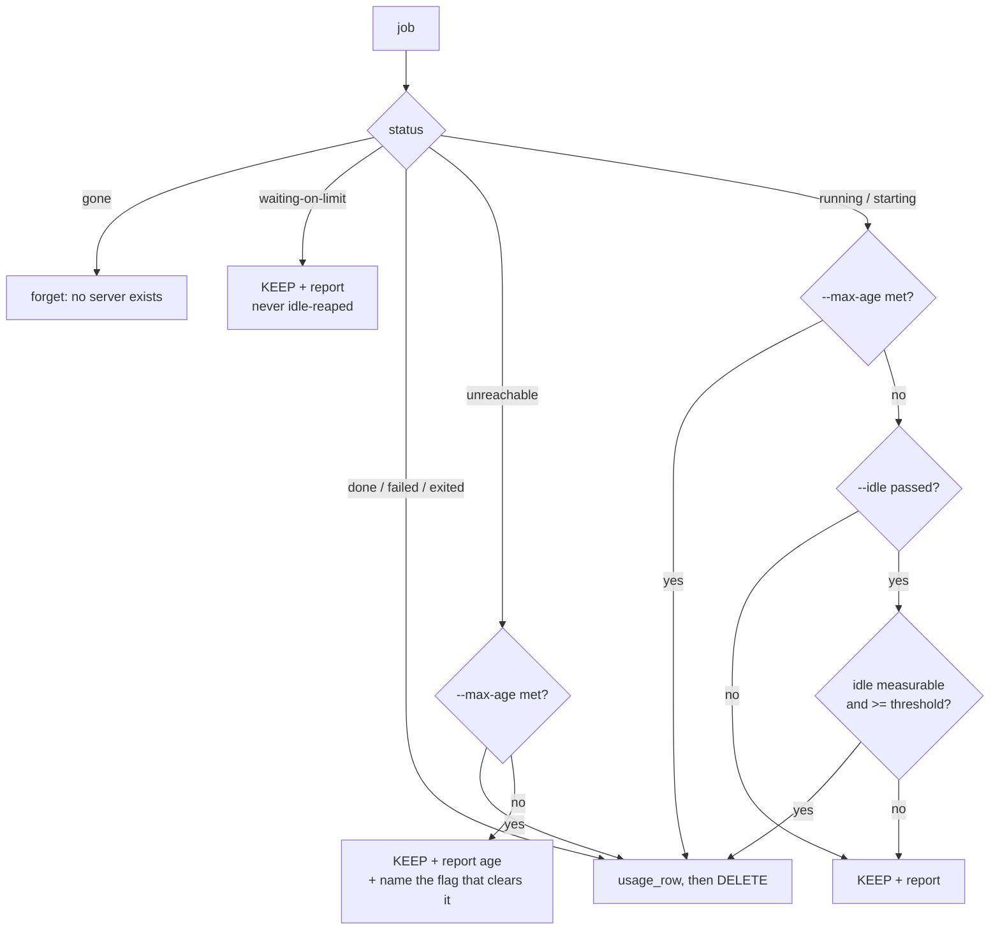

# feat: Idle-based reaping for hdev

## Goal Capsule

`hdev reap --idle 30m` deletes the VM of a job whose agent stopped writing files
more than 30 minutes ago. It closes the stuck-server leak without putting a
Hetzner API token on a job VM.

The tool already measures the right signal. `job_idle()` returns seconds since
the newest file write under the agent's home, and `hdev ps` shows it in the
IDLE column. `cmd_reap()` ignores it and looks only at wall-clock age.

---

## Problem Frame

Hetzner bills a Cloud server for as long as the server object exists, not for as
long as it runs. Powering off does not stop billing; only deletion does. A VM
therefore cannot solve this itself, and deletion needs a Hetzner token that must
never sit on a box where an agent has passwordless sudo.

`cmd_reap()` keeps four statuses and says nothing about any of them:

| Status | Plain reap | Why it happens |
| --- | --- | --- |
| `running` | keeps | a hung agent is indistinguishable from real work by status alone |
| `starting` | keeps | cloud-init failed, or the unit never started |
| `unreachable` | keeps | the firewall allows SSH only from the IP held at submit time |
| `waiting-on-limit` | keeps | correct — it is sleeping through a usage-limit reset |

Only `--max-age` breaks out, it is opt-in, and it judges on the clock alone. The
`unreachable` row is the volume case: changing network makes every running VM
unreachable at once, and plain reap then keeps all of them, silently, forever.

---

## Requirements

- **R1.** `hdev reap --idle <duration>` deletes a tracked job's VM only when its
  measured idle time is at or past the threshold.
- **R2.** `--idle` combines with `--max-age`. Either threshold being met is
  enough to delete.
- **R3.** An invalid or missing `--idle` duration is rejected with a usage error
  before anything is deleted.
- **R4.** A `waiting-on-limit` job is never deleted on idle grounds.
- **R5.** An `unreachable` job is never deleted on idle grounds, and is reported
  explicitly with its age and the flag that clears it.
- **R6.** Plain `hdev reap` keeps its current deletion behaviour and now reports
  every VM it decided to keep, with status and age.
- **R7.** The usage row is captured before any idle-triggered deletion, exactly
  as the existing delete paths do.
- **R8.** Idle must be measurable for every harness `hdev` can run — `claude`,
  `claude-pi`, `pi` and `codex` — before `--idle` is allowed to delete anything.
- **R9.** A non-numeric idle reading is treated as not measurable and never
  causes a deletion.

---

## Key Technical Decisions

**KTD1. Idle is the safety signal, not wall-clock age.**
(session-settled: user-approved — chosen over making `--max-age` the default:
age cannot tell a runaway from slow honest work, whereas a working agent writes
files, so idle can be safe enough to run unattended.)
Governs R1, R2.

The settled decision holds, but review found the premise is only true today for
Claude Code. See KTD9 — it is a prerequisite, not a caveat.

**KTD9. `job_idle` must cover every harness before `--idle` ships.**
`job_idle()` watches `$RHOME/.claude/projects` and `$RHOME/job`. Only Claude
Code writes the first. `pi` is launched with no `--session-dir` (`bin/hdev`, the
`pi)` arm of the agent-command block), so it writes to its own default session
directory, and `codex` writes under `~/.codex`. A healthy pure-`pi` or `codex`
job therefore touches neither watched path and reads as maximally idle — and
`--idle` would delete it while it is working.

`$RHOME/job` does not save it: the orchestrator prompt asks the agent to update
`job/status.md`, but that is a request the model may not honour on any schedule.

Fix by broadening the watched set to include the work tree and every harness's
session directory, rather than by gating on the per-job agent recorded in
`jobs.tsv`. The work tree is the strongest signal available: an agent doing real
work changes files there whatever harness it runs under. Governs R8.

**KTD2. No VM self-shutdown and no Hetzner token on a VM.**
(session-settled: user-approved — chosen over a VM-side idle detector calling
`shutdown -h now`: Hetzner bills the server object until deletion, so shutdown
saves nothing, and it strands the VM as `unreachable`, which plain reap keeps.
A project-scoped token on a box with an agent that has sudo could delete every
sibling job's VM.)

**KTD3. `--idle` requires an explicit duration; there is no bare default.**
Rejected alternative: `--idle` alone meaning 30m. A deletion command that
invents its own threshold when the user forgets an argument is a footgun. The
argument is required and validated. Governs R3.

**KTD4. Duration parsing becomes strict, and validation runs before the
empty-jobs early return.**
`secs()` today echoes an unparseable value back verbatim, so `secs 30q` yields
`30q` and the later `[ "$age" -ge "$limit" ]` aborts the script under
`set -euo pipefail` with a bash error rather than a usage message. Validating up
front also makes flag handling testable offline, because the error fires before
reap needs any Hetzner call. Governs R3.

**KTD5. Argument parsing becomes a loop.**
Today `cmd_reap` tests `$1` against `--max-age` exactly once, which cannot
accept two flags. R2 requires a `while` loop over the arguments.

**KTD6. Idle is measured only where it is meaningful.**
`job_idle()` costs a second SSH round trip per job. Measure it only for
`running` and `starting`, and only when `--idle` was passed. `done`, `failed`
and `exited:*` are already deleted by plain reap; `gone` has no server;
`waiting-on-limit` is carved out by KTD7; `unreachable` cannot be measured
because the SSH that would measure it is the thing that failed.

**KTD7. `waiting-on-limit` is checked before any idle logic.**
A job sleeping through a usage-limit reset writes no files, so it looks
maximally idle while being perfectly healthy. This is the one status where the
idle signal actively lies. Governs R4.

**KTD8. The session-end hook keeps plain `reap` by default; `--idle` in the hook
is opt-in via `HDEV_REAP_IDLE`.**
Rejected alternative: making the shipped hook idle-reap automatically. The hook
already ships and runs unattended at session end; silently gaining the power to
delete a *running* job is a behaviour change the user did not ask for. The
documented cron line adopts `--idle` instead, where the user opts in by writing
it. Governs the Documentation units.

---

## Scope Boundaries

In scope: `cmd_reap` argument parsing, the idle branch, the keep-reporting, the
`unreachable` report, tests, and the four documents.

### Deferred to Follow-Up Work

- Applying the same strict duration validation to `--max-age`. It shares the
  `secs()` weakness described in KTD4. The new validator is written so it can
  cover both, but changing `--max-age`'s error behaviour is a separate change to
  shipped behaviour.
- Auto-refreshing the firewall rule so `unreachable` stops happening on a
  network change. That is the root cause of the volume case; this plan makes it
  visible and clearable rather than fixing it.

### Non-Goals

- Any VM-side self-termination (KTD2).
- Changing what `hdev ps` displays.

---

## High-Level Technical Design

Reap's decision for one tracked job, after this change:

The only new deletion path is K. Every other edge is today's behaviour, with
reporting added on the KEEP edges.

---

## Implementation Units

### U1. Strict duration parsing and looped flag handling

**Goal:** `cmd_reap` accepts `--idle <dur>` and `--max-age <dur>` in any order,
and rejects a bad duration with a usage error before touching Hetzner.

**Requirements:** R2, R3. Implements KTD3, KTD4, KTD5.

**Dependencies:** none.

**Files:**
- `bin/hdev` — new `secs_check()` (or equivalent validating wrapper) near
  `secs()`; rewrite the head of `cmd_reap()`.
- `test_hdev.sh` — flag-parsing checks.

**Approach:**
1. Add a validator beside `secs()` that accepts `<digits>` optionally suffixed
   by `s`/`m`/`h`/`d`, and dies with a usage message otherwise. Return seconds
   on success so callers do not parse twice.
2. Replace the single `--max-age` test in `cmd_reap()` with a `while` loop
   handling `--idle`, `--max-age`, an unknown-flag error, and end-of-arguments.
3. A flag given without a value must produce the usage error, not consume the
   next flag as its value. `--idle --max-age 4h` is a usage error.
4. Keep validation above the `[ -s "$JOBS" ]` early return so it fires with an
   empty job list.

**Patterns to follow:** `die`/`say` usage and the `usage: hdev ...` message
shape already used by `cmd_ssh`, `cmd_logs` and `cmd_mode` (`die()` is defined
at the top of `bin/hdev` and prints `hdev: <message>`).

**Test isolation — required.** `test_hdev.sh` exports one shared
`HDEV_STATE_DIR`, and the `submit` checks that run first populate `jobs.tsv` in
it. A reap check inherited from that shared directory would get past the
`[ -s "$JOBS" ]` early return and attempt real Hetzner and SSH calls, breaking
the offline guarantee. Give the reap checks their own `mktemp -d` state
directory, as the existing model-persistence check does with `MD_STATE`.

**Test scenarios:**
- `hdev reap --idle` with no value exits non-zero and prints a usage message
  naming `--idle`.
- `hdev reap --idle 30q` exits non-zero and names the bad value; it must not
  emit a raw bash "integer expression expected" error.
- `hdev reap --idle --max-age 4h` is rejected rather than parsing `--max-age`
  as the idle duration.
- `hdev reap --idle 30m --max-age 4h` against an empty job list passes
  validation and reaches the existing `no jobs` path, proving both flags parse.
- `hdev reap --bogus` is rejected as an unknown flag.
- `hdev reap` with no arguments still reaches `no jobs` unchanged.
- Valid units each parse: `90s`, `30m`, `4h`, `2d`.

**Verification:** the flag-parsing checks pass offline with no Hetzner call.

---

### U5. Make idle measurable for every harness

**Goal:** `job_idle` reports real activity for a `claude`, `claude-pi`, `pi` or
`codex` job, so `--idle` cannot mistake a working agent for a dead one.

**Requirements:** R8. Implements KTD9.

**Dependencies:** none. **This is a prerequisite for U2** — U2 must not be
considered done until this unit has landed, because without it `--idle` deletes
healthy `pi` and `codex` jobs.

**Files:**
- `bin/hdev` — `job_idle()`.
- `test_hdev.sh` — watched-path checks.

**Approach:**
1. Broaden the `find` in `job_idle` to cover the work tree and each harness's
   session directory alongside today's two paths. Determine the real `pi` and
   `codex` session directories on a live VM rather than assuming them; record
   what was found.
2. Keep `2>/dev/null` on the `find` so a path that does not exist on a given
   box stays silent instead of failing the whole measurement.
3. Do not gate on the agent recorded in `jobs.tsv`. A broadened path set is one
   change with no per-agent branching to keep in sync.
4. Leave the empty-output contract unchanged: no files found still means not
   measurable.

**Patterns to follow:** the existing `printf | rssh 'bash -s'` construction in
`job_idle`, which already passes paths through `%s` placeholders.

**Test scenarios:**
- `job_idle` references the work tree, so an agent editing the repo registers as
  active regardless of harness.
- `job_idle` references a session path for `pi` and for `codex`, not only
  `.claude/projects`.
- The `find` still suppresses errors for absent paths.
- An absent path does not make the whole measurement return empty.

**Verification:** on a live VM running a `pi` job, `hdev ps` shows an IDLE value
that falls when the agent is working. Confirm on a real job before U2 is
enabled — this is the unit that makes `--idle` safe, so a structural test alone
is not sufficient evidence.

---

### U2. Idle-based deletion

**Goal:** with `--idle <dur>`, a `running` or `starting` job whose agent has not
written a file within the threshold has its VM deleted.

**Requirements:** R1, R2, R4, R5, R7, R9. Implements KTD6, KTD7.

**Dependencies:** U1, **U5** (without U5 this unit deletes healthy `pi` and
`codex` jobs).

**Files:**
- `bin/hdev` — the per-job loop in `cmd_reap()`.
- `test_hdev.sh` — structural checks on the carve-outs.

**Approach:**
1. Keep the existing `waiting-on-limit` carve-out first in the loop so no idle
   logic can reach it (KTD7).
2. Keep the existing `--max-age` branch ahead of the idle branch; age already
   covers the case where idle cannot be measured.
3. Add the idle branch: only when `--idle` was passed, and only for `running`
   and `starting`. Call `job_idle`, and treat an empty result as "not
   measurable" — never as zero and never as infinity.
3b. Validate that the reading is digits before comparing it (R9). `job_idle`
   returns output from the job VM, which runs an agent with sudo, so its value
   is untrusted input. Compare with `[ "$idle" -ge "$limit" ]` after the digit
   check; never feed it to arithmetic expansion. A non-numeric reading is not
   measurable and must not delete.
4. Delete only when the measured value is at or past the threshold. Capture
   `usage_row` first, matching the existing delete paths (R7).
5. Say why on deletion, including the measured idle time, so the log explains
   the decision: name the job, the idle duration, the threshold, and the status
   it held.

**Patterns to follow:** the existing `--max-age` deletion branch in `cmd_reap()`
— `usage_row … >> "$USAGE"`, then `hcloud server delete … && say …`.

**Test scenarios:**
- The `waiting-on-limit` branch appears before any idle handling in the function
  body, so the carve-out cannot be bypassed.
- The idle deletion path calls `usage_row` before `hcloud server delete`.
- The idle branch is reachable only for `running` and `starting`; `unreachable`
  is not among the statuses it can delete.
- An empty `job_idle` result is guarded against being compared numerically,
  which would abort the script under `set -e`.
- The `--max-age` branch still precedes the idle branch.

**Verification:** `hdev reap --idle 30m` deletes a hung job's VM and leaves a
job that is actively writing files untouched. Confirm against real jobs before
the change is considered done; the offline suite covers structure only.

---

### U3. Report every kept VM

**Goal:** plain `hdev reap` names each VM it keeps, with status and age, and
tells the user which flag clears an `unreachable` one.

**Requirements:** R5, R6.

**Dependencies:** U2.

**Files:**
- `bin/hdev` — the keep branch of `cmd_reap()`.
- `test_hdev.sh` — reporting checks.

**Approach:**
1. On every keep, emit one `say` line: job name, status, age.
2. For `unreachable`, add the cause and the remedy — SSH is blocked from the
   current IP, and `reap --max-age` is what removes it. This is R5's whole
   point: the silence is the bug.
3. Keep the existing orphan/untracked-VM reporting unchanged.
4. Do not let reporting change any deletion decision.

**Approach note:** age comes from the `server_ages` lookup the loop already
performs; do not add a Hetzner call for it. **Guard it before formatting.**
`age` is empty whenever the server is absent from the `hdev=1` label query, and
`human_age ""` evaluates `[ "" -ge 86400 ]`, which aborts the script under
`set -euo pipefail`. The existing `--max-age` branch guards with `[ -n "$age" ]`
for this reason; the report path needs the same guard, and should print a
placeholder rather than a formatted age when there is none.

**Test scenarios:**
- The keep branch emits a message rather than silently appending to the keep
  file.
- The `unreachable` message names `--max-age` as the flag that clears it.
- The `waiting-on-limit` message still explains that the job is waiting for its
  usage window, as it does today.
- Existing orphan reporting is unchanged.

**Verification:** `hdev reap` with a mix of kept jobs prints one line per kept
VM and deletes exactly what it deletes today.

---

### U4. Documentation and the opt-in hook variable

**Goal:** the four documents describe `--idle`, and the session hook can adopt
it without changing its default.

**Requirements:** R1, R6. Implements KTD8.

**Dependencies:** U1, U2, U3.

**Files:**
- `README.md` — the reap command list and the Cost section.
- `SETUP.md` — the cron safety-net section; the recommended cron line moves to
  `--idle`.
- `skills/hetzner-dev/SKILL.md` — "Watching jobs and closing them out" and the
  session-hook backstop section.
- `skills/hetzner-dev/hooks/session.sh` — honour `HDEV_REAP_IDLE` when set,
  plain `reap` when not.
- `test_hdev.sh` — documentation and hook checks.

**Approach:**
1. Document `--idle` as the flag that is safe to run unattended, and state the
   reason: a working agent writes files, so idle cannot mistake work for a
   runaway. Keep the existing warning that `--max-age` cannot make that
   distinction.
2. Move the documented cron line to `--idle`, keeping `--max-age` as the
   heavier hammer for `unreachable` VMs, which idle cannot measure.
3. In the hook, read `HDEV_REAP_IDLE`; when set, pass `--idle "$HDEV_REAP_IDLE"`.
   Default stays plain `reap` (KTD8).
4. Record in the README that powering a VM off does not stop Hetzner billing.
   That fact is why the design is shaped this way and it is currently written
   down nowhere.

**Test scenarios:**
- The README documents `reap --idle`.
- The SKILL documents `--idle` and the reason idle beats age.
- The hook references `HDEV_REAP_IDLE`.
- No document states a check count (an existing rule; it went stale twice).

**Verification:** `./test_hdev.sh` passes and the documents describe the shipped
flags.

---

## Verification Contract

1. `./test_hdev.sh` passes with no `FAIL` lines and exits 0. It must report more
   checks than the 208 on `main`, and no existing check may be weakened or
   removed.
2. The suite stays offline: no Hetzner API call, no SSH.
3. `hdev reap` with no flags deletes exactly what it deletes today.
4. `bash -n bin/hdev` parses clean, and the script stays bash 3.2 compatible —
   no associative arrays, no `${var,,}`, no `mapfile`.
5. The reap checks run in their own `HDEV_STATE_DIR`, so no check reaches
   Hetzner or SSH.
6. Live check before calling it done, and it must cover more than one harness:
   run `hdev reap --idle <dur>` against a real `pi` job that is actively working
   and confirm it is spared, and against a genuinely stuck job and confirm it is
   deleted. Sparing a working `pi` job is the specific evidence that U5 worked;
   a passing offline suite is not that evidence.

## Definition of Done

- R1 through R9 are implemented and covered by tests.
- U5 has landed and its live check has been run. `--idle` is not safe to
  document or recommend until a working `pi` job has been observed surviving it.
- The four documents describe `--idle` and no longer imply that plain `reap`
  clears everything.
- No Hetzner token is written to a VM, and no VM-side shutdown logic exists.
- The offline suite passes, and the live check in the Verification Contract has
  been run and reported.

---

## Risks

- **Deleting live work — the main risk of this change.** Review found the
  original framing was wrong: `job_idle` watches Claude Code's transcript
  directory, so a healthy `pi` or `codex` job reads as maximally idle. U5 is the
  mitigation and is a hard prerequisite for U2, not a nice-to-have. After U5,
  the residual risk is a job doing something long and genuinely silent — a large
  build touching no watched path. Mitigated further by requiring an explicit
  threshold (KTD3) and by choosing one well above a slow turn.
- **`job_idle` returning empty.** Treated as not measurable, never as zero.
  Getting this backwards would delete healthy jobs; the test scenario in U2
  exists for exactly this.
- **A second SSH round trip per job.** Bounded by the existing
  `ConnectTimeout=6` and only incurred when `--idle` is passed (KTD6).

## Open Questions

- What idle threshold is right in practice? The documented cron example needs a
  number; pick a conservative one and let real use correct it. Deferred to
  execution — it is a documentation value, not a code decision.

## Sources & Research

- Hetzner billing: a Cloud server is billed while the server object exists;
  powering off does not stop it. Verified against Hetzner's billing
  documentation during planning.
- No server TTL or auto-delete feature was found in the Hetzner Cloud API
  documentation. Recorded as "not found", not as "does not exist".
- `bin/hdev` — `cmd_reap()`, `job_status()`, `job_idle()`, `secs()`,
  `human_age()`, `server_ages()`, `usage_row()` read directly during planning.
